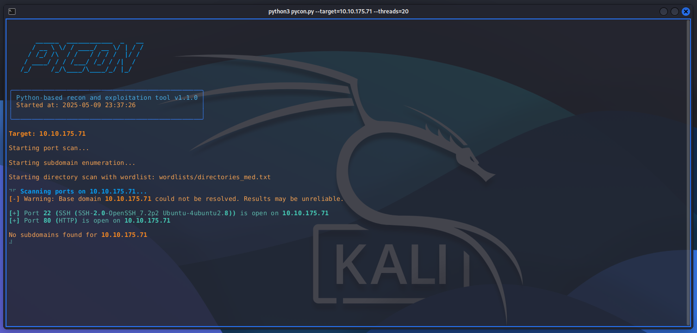
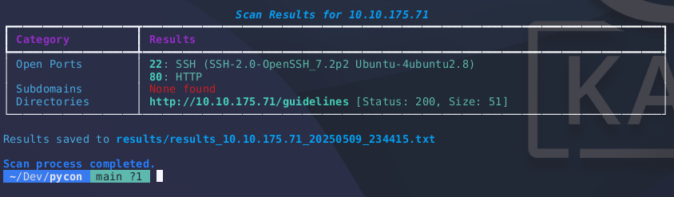

# P Y C O N



PyCon is a Python-based tool for performing subdomain and directory enumeration on a target domain. It utilizes wordlists to discover potential subdomains and directories, helping in the reconnaissance phase of a security assessment.

## Installation

Provide instructions on how to install your project. For example:

```bash
pip install -r requirements.txt
```

## Usage

To use PyCon, you can run the `pycon.py` script from your terminal.



**Basic Usage:**

```bash
python pycon.py --target example.com
```

This command will run the enumeration against `example.com` using the default wordlist for directories (`wordlists/directories.txt`) and 10 threads.

**Advanced Usage:**

You can specify a custom wordlist for directory enumeration and a different number of threads:

```bash
python pycon.py --target example.com --wordlist-dir /path/to/your/custom_directory_wordlist.txt --threads 20
```

**Arguments:**

*   `--target`: (Required) The target domain (e.g., example.com).
*   `--wordlist-dir`: (Optional) Path to the wordlist file for directory enumeration. Defaults to `wordlists/directories.txt`.
*   `--threads`: (Optional) Number of threads for directory enumeration. Defaults to 10.

## Contributing

Information on how others can contribute to your project.

## License

Specify the license for your project (e.g., MIT, Apache 2.0).